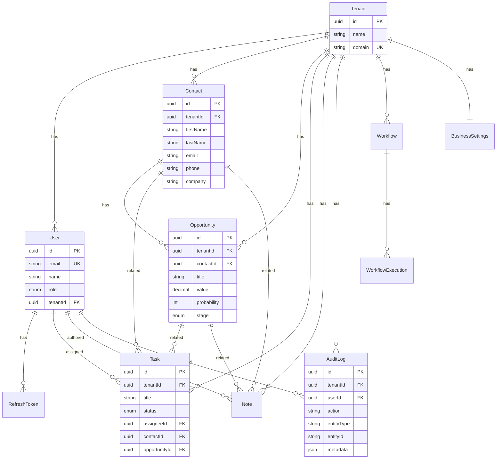

# Architecture Documentation

## System Overview

The AI Business Operations Platform is a multi-tenant SaaS application that unifies CRM management, AI-powered business intelligence, and communication channels into a single operational dashboard.

---

## Architecture Diagram

```mermaid
graph TB
    subgraph Client["Browser (React)"]
        UI["Dashboard UI"]
        RQ["React Query Cache"]
    end

    subgraph Edge["Next.js Edge Middleware"]
        MW["Auth + RBAC + Rate Limit + CORS + CSRF"]
    end

    subgraph API["Next.js API Routes"]
        AUTH["/api/auth/*"]
        CRM["/api/crm/*"]
        AI["/api/ai/chat"]
        INBOX["/api/inbox/*"]
        DASH["/api/dashboard/metrics"]
        WH["/api/webhook/whatsapp"]
        WF["/api/workflows/logs"]
    end

    subgraph Services["Feature Services"]
        AS["AuthService"]
        CS["ContactService"]
        OS["OpportunityService"]
        CHAT["ChatService"]
        WE["WorkflowEngine"]
        WA["WhatsappFactory"]
    end

    subgraph Data["Data Layer"]
        PG[("PostgreSQL (Prisma)")]
        MG[("MongoDB (Mongoose)")]
    end

    subgraph External["External APIs"]
        GEMINI["Gemini 2.5 Flash"]
        META["Meta Cloud API"]
        GOOGLE["Google OAuth"]
    end

    UI --> RQ --> MW --> API
    AUTH --> AS --> PG
    AUTH --> AS --> GOOGLE
    CRM --> CS --> PG
    CRM --> OS --> PG
    OS --> WE
    AI --> CHAT --> GEMINI
    AI --> CHAT --> MG
    CHAT --> CS
    CHAT --> OS
    INBOX --> MG
    DASH --> PG
    DASH --> MG
    WH --> WA --> META
    WH --> MG
    WF --> MG
    WE --> GEMINI
    WE --> WA
    WE --> PG
    WE --> MG
```

---

## ER Diagram

---

## API Reference

### Authentication
| Method | Endpoint | Description |
|--------|----------|-------------|
| GET | `/api/auth/login` | Initiates Google OAuth flow |
| GET | `/api/auth/callback/google` | OAuth callback handler |
| POST | `/api/auth/refresh` | Refresh access token (RTR) |
| POST | `/api/auth/logout` | Revoke all sessions |
| GET | `/api/auth/me` | Get current user profile |
| POST | `/api/auth/onboard` | Create tenant & link user |

### CRM
| Method | Endpoint | Description |
|--------|----------|-------------|
| GET | `/api/crm/contacts` | List contacts (paginated, searchable) |
| POST | `/api/crm/contacts` | Create contact |
| GET | `/api/crm/contacts/[id]` | Get contact by ID |
| PUT | `/api/crm/contacts/[id]` | Update contact |
| DELETE | `/api/crm/contacts/[id]` | Soft-delete contact |
| GET | `/api/crm/opportunities` | List opportunities |
| POST | `/api/crm/opportunities` | Create opportunity |
| PUT | `/api/crm/opportunities/[id]` | Update opportunity |
| DELETE | `/api/crm/opportunities/[id]` | Soft-delete opportunity |
| GET | `/api/crm/tasks` | List tasks |
| POST | `/api/crm/tasks` | Create task |
| PUT | `/api/crm/tasks/[id]` | Update task |

### AI Agent
| Method | Endpoint | Description |
|--------|----------|-------------|
| POST | `/api/ai/chat` | Stream AI response (SSE) |

### Dashboard
| Method | Endpoint | Description |
|--------|----------|-------------|
| GET | `/api/dashboard/metrics?period=30d` | Aggregated business metrics |

### Inbox
| Method | Endpoint | Description |
|--------|----------|-------------|
| GET | `/api/inbox/conversations` | List conversations |
| GET | `/api/inbox/messages?conversationId=X` | Get messages |

### WhatsApp
| Method | Endpoint | Description |
|--------|----------|-------------|
| GET | `/api/webhook/whatsapp` | Webhook verification |
| POST | `/api/webhook/whatsapp` | Incoming message handler |
| POST | `/api/whatsapp/send` | Send outbound message |

### Workflows
| Method | Endpoint | Description |
|--------|----------|-------------|
| GET | `/api/workflows/logs` | Fetch execution logs |

---

## Security Architecture

| Protection | Implementation |
|------------|---------------|
| **Helmet Headers** | `next.config.ts` security headers (X-Frame, CSP, HSTS, etc.) |
| **Rate Limiting** | In-memory sliding window (100/min general, 10/min auth, 20/min AI) |
| **CORS** | Origin whitelist enforcement in Edge Middleware |
| **CSRF** | Origin/Referer header validation for mutating requests |
| **XSS** | HTML tag stripping via `sanitize.ts` + CSP headers |
| **SQL Injection** | Prisma ORM parameterized queries (inherent protection) |
| **Auth** | JWT access tokens (15min) + refresh tokens with RTR |
| **Tenant Isolation** | `tenantId` injected via middleware, enforced in every query |

---

## Performance Optimizations

- **React Query**: Background polling (15s stale time) with automatic deduplication
- **React.memo**: Dashboard components wrapped in `React.memo()` + `useMemo()` for zero-overhead renders
- **Prisma Indexes**: Composite indexes on `(tenantId, deletedAt)`, `(tenantId, createdAt)` for fast tenant-scoped queries
- **MongoDB Indexes**: Compound indexes on `(tenantId, channel)`, unique sparse on `(tenantId, externalId)` for idempotency
- **Streaming**: AI responses use SSE (Server-Sent Events) for real-time token delivery
- **Context Pruning**: AI chat limits history to last 20 messages to prevent token bloat
- **Aggregate Queries**: Dashboard uses `Prisma.aggregate()` and `groupBy()` instead of `findMany()` + JS reduce

---

## Future Improvements

1. **Redis Rate Limiting** — Replace in-memory store with Redis for horizontal scaling
2. **BullMQ Job Queue** — Persistent background job processing with Redis-backed queues
3. **WebSocket Notifications** — Real-time push for inbox messages and workflow completions
4. **Email Integration** — SMTP/SendGrid adapter following the same Adapter pattern as WhatsApp
5. **Multi-Provider AI** — Support for OpenAI, Anthropic via provider abstraction
6. **Advanced RBAC** — Permission-based access control with custom roles
7. **Analytics Engine** — Time-series revenue tracking and forecasting
8. **Audit Log Dashboard** — Visual timeline of all system events
9. **i18n** — Internationalization support
10. **E2E Tests** — Playwright end-to-end test suite
